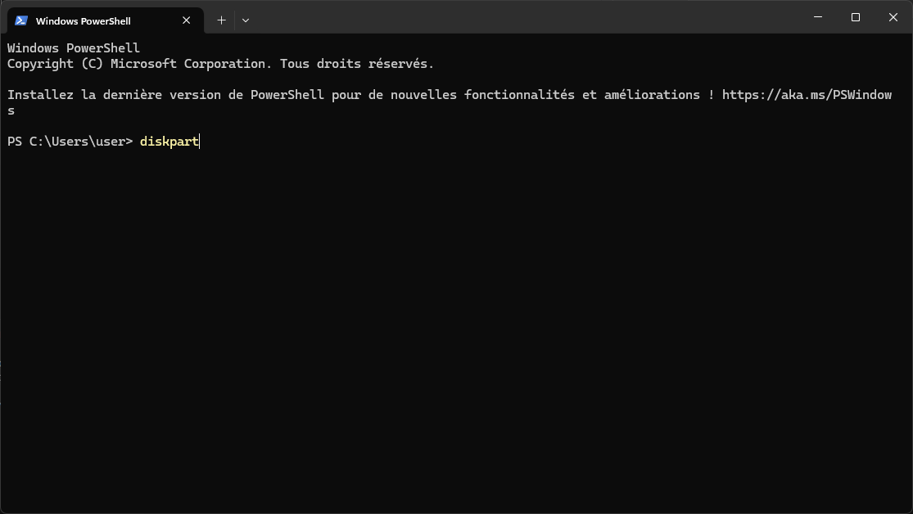
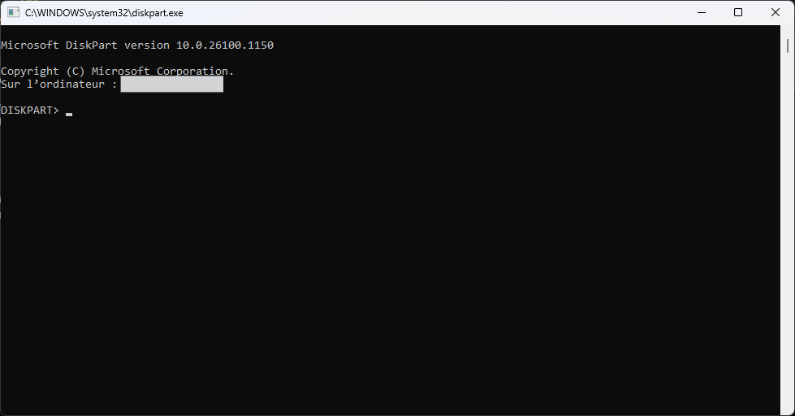
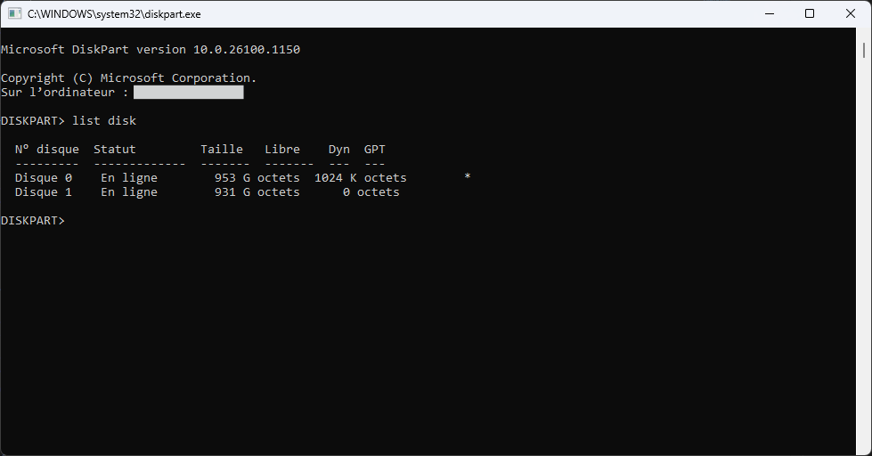
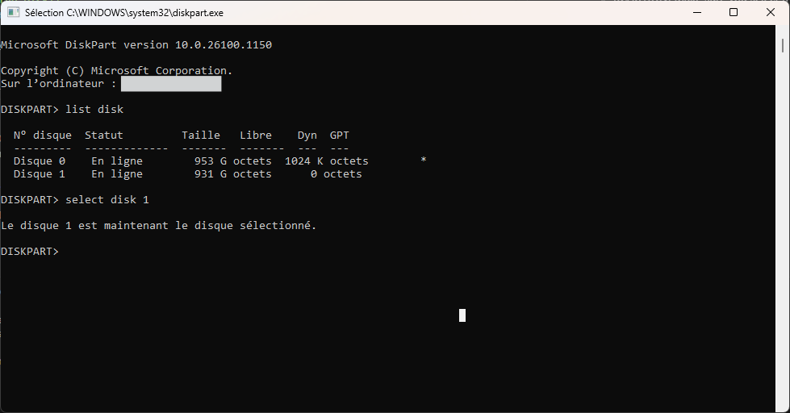

# Format a hard drive using the command line

To format a hard drive using the command line in Windows, you can use the `diskpart` utility. Here are the steps:

Why use the command line `diskpart` tool instead of Disk Management?
- The command line tool `diskpart` is more powerful and flexible than the Disk Management GUI. It allows for more advanced operations.
- Notably, with Disk Manager, the tool does not allow certain operations, such as the **deletion of a specific volume type**, like a **recovery partition**.
- It can be used in scripts for automation.


## 1. **Open Command Prompt as Administrator**:
Open the Start menu, type `cmd`, right-click on "Command Prompt", and select "Run as administrator".


## 2. **Launch Diskpart**:
Write the following command and press Enter:

```cmd
diskpart
```



The diskpart utility may open a new cmd window.




## 3. **List Disks**:
In the diskpart window, type the following command to list all disks:

```cmd
list disk
```
This will show you all the disks connected to your computer.




## 4. **Select the Disk**:
Identify the disk you want to format (e.g., Disk 1) and select it by typing:

```cmd
select disk 1
```

> [!IMPORTANT]
> Replace `1` with the number of the disk you want to format.

> [!CAUTION]
> Make sure you select the correct disk, as this will **ERASE ALL DATA** on it.

And enter.




> [!NOTE]
> From now on I will no longer be able to provide illustrations, for obvious reasons.


## 5. **Clean the Disk**:
To remove all partitions and data from the selected disk, type:

```cmd
clean
```

> [!CAUTION]
> This command will **DELETE ALL PARTITIONS** and **DATA** on the selected disk.


## 6. **Create a New Partition**:
To create a new primary partition, type:

```cmd
create partition primary
```

This will create a new partition that uses the entire disk space.


## 7. **Format the Partition**:
To format the newly created partition, type:

```cmd
format fs=ntfs quick
```

This will format the partition with the NTFS file system. You can replace `ntfs` with `exfat` or `fat32` if you prefer a different file system.


## 8. **Assign a Drive Letter**:
To assign a drive letter to the formatted partition, type:

```cmd
assign
```

If you want to assign a specific drive letter, you can use:
```cmd
assign letter=E
```

Replace `E` with the desired drive letter that is not already in use.


## 9. **Exit Diskpart**:
Finally, type:

```cmd
exit
```

to exit the diskpart utility.

OR simply close the command prompt window.


## 10. **END**
Congratulations! You have successfully formatted a hard drive using the command line in Windows.